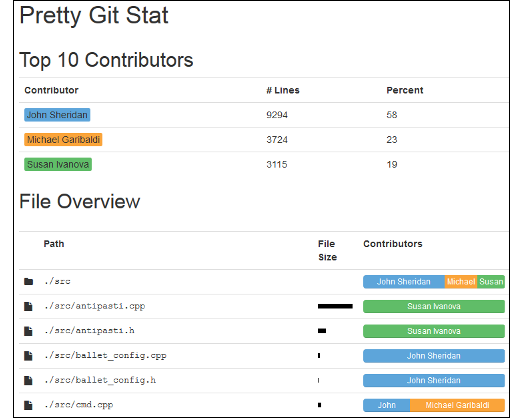

Pretty Git Stat
===============

Pretty Git Stat shows who contributed how much to a [git][] project.

Pretty Git Stat produces a pretty page which shows the top contributors to a
project, as well as a detailed attribution on a per-file basis. Large data
files (e.g. images, database exports, ...) that would distort the results can
be excluded.

Pretty Git Stat analyzes the current codebase based on `git blame` output. It
doesn't matter who contributed something historically, only how much of that
person's contributions remains in the current version. This makes Pretty Git
Stat complimentary to Jonathan Corbet's [gitdm (git data miner)][gitdm], which
analyzes contributions based on the commit history (`git log` data).

## Screenshots

## Usage

    $ cd some-git-project
    $ ../prettygitstat/prettygitstat.py > ../prettygitstat/stat.json

Then open `prettygitstat.html` in a web browser (JavaScript required).

### Excluding Files

Each line in the "Excludes" text box is matched against the file names (using
regular expression syntax). If any of the excludes match, the file is removed
from the statistics analysis. Exclude lines can be prefixed with an exclamation
mark ("`!`") to indicate special files to keep. The expressions are processed
in order, the first expression to match is applied.

Exclude all PNG files:

    \.png

Exclude every file in `tests` directories:

    /tests/

Exclude every file under `js`, but keep `prettygitstat.js`:

    !js/prettygitstat.js
    js/

[git]: https://git-scm.com/
[gitdm]: https://lwn.net/Articles/290957/
